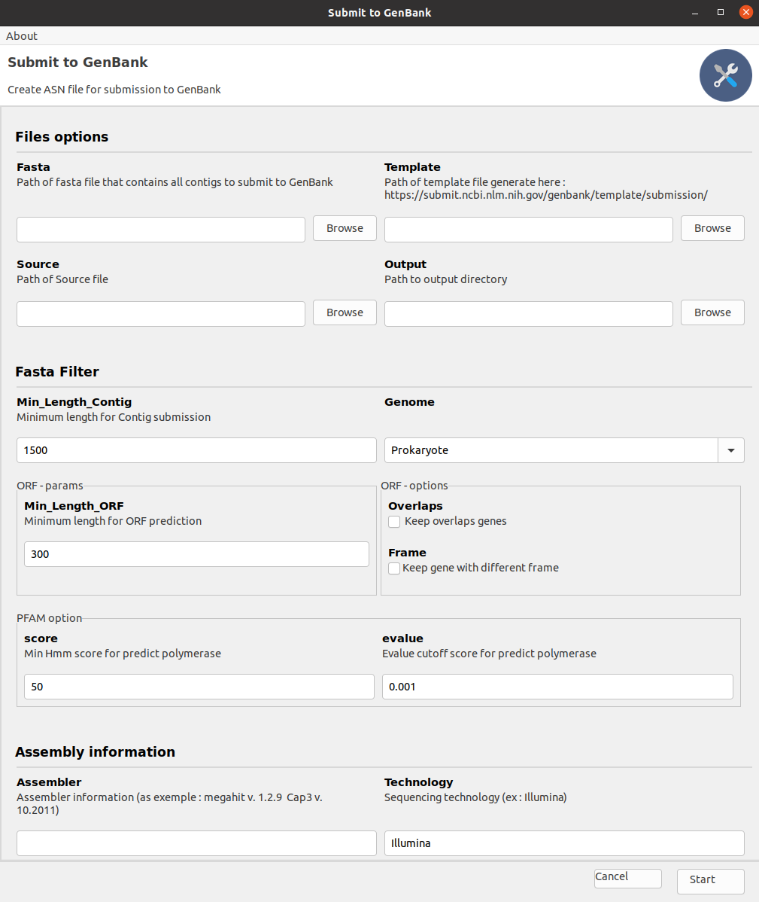

# What is Gsub ?

Gsub is a Graphical User Interface (GUI) tool written in python which allow to annotate and submit a large number of viral sequences.
Gsub uses python package *ORFfinder* to identify and annotate openreading frames (ORFs) in 
the sequences. Then, python package *pyHMMER* is used to detect potential polymerase-encoding ORFs 
(detection threshold can be modify in parameters). 
[Table2asn](https://www.ncbi.nlm.nih.gov/genbank/table2asn/) , a GenBank tools, is then used to collect the different 
information and to generate the corresponding sqn file for each sequence. 
The python packages *Gooey* and [Pyinstaller 5.2](https://pyinstaller.org/) allow respectively for 
a graphical interface and to run Gsub in Windows or Linux without installing a Python interpreter.

# Install

They are two differents way to install Gsub tool.

The first way is to download executbale file for you os (Linux or Windows) here :

* <a href="https://github.com/FlorianCHA/upload-file/raw/master/Gsub_linux">Gsub for Linux</a>

* <a href="./Gsub/exec/Gsub_windows.exe" download>Gsub for Windows 10</a>

The second way is to install the Gsub package on pypi. For that you can use the follow command line :

> pip install gsub

Then you can launch the Graphical interface with the follow command line :

> submission_GenBank_UI

# Running Gsub

## Files options

### Fasta

A file at fasta format which contains all sequences to submit at GenBank data base. 

### Template

The template file contain all information about publication, bio-projet and author. You can create this file 
[here](https://submit.ncbi.nlm.nih.gov/genbank/template/submission/).

### Source

The source file is an information file which contains all information for submission. Below you can file a exemple for this file.
You can find an example file in the example directory. 

| Sequence_ID | Definitions                     | Organism     | Strain     | Country | Host          | Collection_date | Molecule | Lineage                   | reverse |
|-------------|---------------------------------|--------------|------------|---------|---------------|-----------------|----------|---------------------------|---------|
| Contig_1    | Alilaet Virus, partial sequence | Alilaet virus | Egypt_2022 | Egypt   | Culex pipiens | 2022            | RNA      | Riboviria; Picornavirales | 1       | 
| Contig_2    | Ana Virus, partial sequence     | Ana virus    | France_2015 | France  | Culex pipiens | 2015            | RNA      | Riboviria; Jingchuvirales | -1      |

note : In the reverse columns you can put any number. you need only negative value for reverse strand and positive value for positive value.
### Output

A directory output that contains different subdirectories:

* GBF directory that contains a gbf file for each contig. Gbf file can be used for visualized the final submission at GenBank format
* SQN directory that contains a sqn file for each contigs. It's this files that can be send by mail at XX for submission.

And in this output directory, we have also error summary file for all sequence with the common discrepancy report for all the sequences with error messages due to discrepancies with submission requirements.

## Fasta Filter 

| Argument             | Definition                                                                                                            |
|----------------------|-----------------------------------------------------------------------------------------------------------------------|
| Min_Length_Contig    | The minimum length of sequence to be submitted                                                                        |
| Genome               | Eukaryote or Prokaryote (for translation code used for submission)                                                    |
| Min_Length_ORF       | Minimum length of orf to keep it in submission                                                                        |
| Remove overlaps      | If checked the tool will keep all the orf that are overlapped instead of keeping only the largest orf                 |
| Keep only one strand | If checked the tool will keep all orf that are on both strands instead of keeping only the orf on the majority strand |
| PFAM option          | Score and evalue minimum for predict polymerase                                                                       |

## Assembly information

### Assembler 

In this part you must give the differents assembler used for your sequences. Be careful, you must add the version of each tools at this format : v. X.X.X

Exemple :
   
     Megahit v. 1.2.9 & Cap3 v. 10.2011

### Technology

Here you must give the sequencing technology as exemple (e.g ABI 3730; 454 GS-FLX Titanium; Illumina GAIIx)
